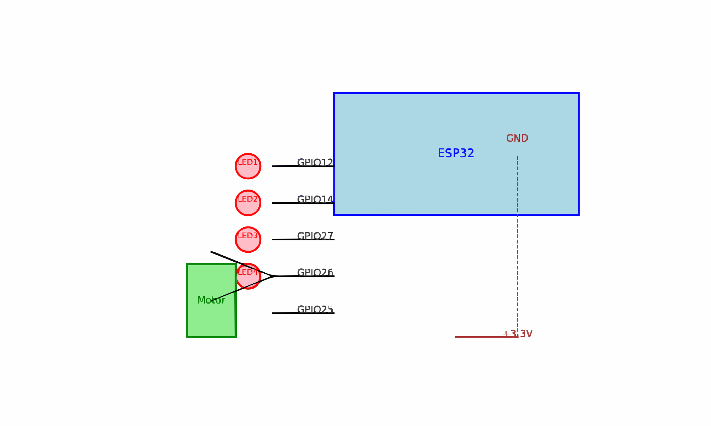
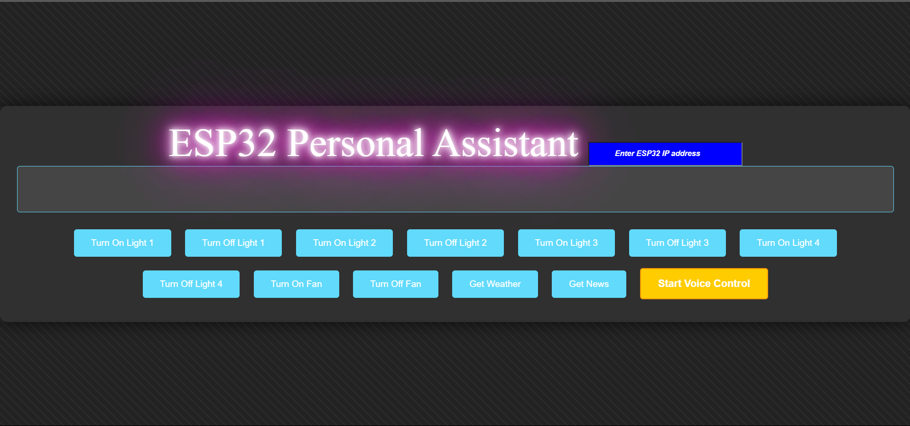

# 🚀 **ESP32-Based IoT Home Automation System** 

---

## **Introduction** 🏠  
This project transforms an ordinary home into a **smart home** using an ESP32 microcontroller. With this system, users can monitor and control appliances remotely, enhancing convenience, efficiency, and energy management.

---

## **🌟 What Can It Do?**
- ✅ **Remote Control:** Operate devices (e.g., LED lights, DC motors) via Wi-Fi.  
- ✅ **Real-Time Monitoring:** Check device statuses in real-time.  
- ✅ **Scalability:** Add more devices as needed.  

### **📅 When Can It Be Helpful?**
- While traveling or at work to control devices remotely.  
- For automating tasks like turning on lights at sunset.  
- To enhance convenience and energy management.  

### **❓ Why Do You Need It?**
- Save time and effort.  
- Enhance comfort and experience of living in a smart home.  
- Gain better control of energy consumption.  

---

## **✨ Benefits of the IoT Project**
- 💡 Simplifies home automation with low-cost components.  
- 🛠️ Easy to expand and customize.  
- 🌍 Provides an introduction to IoT and smart technologies.  
- ⚡ Improves energy efficiency.  

---

## **⚙️ Hardware Requirements**  
| Component        | Quantity   |  
|-------------------|------------|  
| ESP32 Board       | 1          |  
| LED Lights        | As needed  |  
| DC Motors         | As needed  |  
| Power Supply      | 1          |  
| Breadboard/PCB    | 1          |  
| Connecting Wires  | As needed  |  

### **💻 Software Requirements**  
- [Thonny]([text](https://thonny.org/))  
- ESP32 Board Support Package ([Install Guide](https://www.youtube.com/watch?v=elBtWZ_fOZU))  
- Libraries:
  - 💡`Network`
  - 💡`socket`
  - 💡`machine`
  - 💡 `time`

---

## **📐 Circuit Diagram**

---

## **📖 Usage Instructions**  
1. **Set Up the Hardware:**  
   - Connect ESP32 to LED lights and DC motors.  
   - Ensure all connections are secure and powered correctly.  

2. **Prepare the Software:**  
   - Install Thhony IDE and ESP32 board support.  
   - Clone the [project repository](#).  
   - Wi-Fi credentials in the code (`SSID` and `Password`).   `# Make sure it is in 2.5 ghz`
   - Upload the code to ESP32.  

3. **Access the Interface:**  
   - Note the IP address displayed in shell.  
   - Start the webpage by   `Open CMD in Webpage folder`  `Type **index.html** an d Open the IP Link Shown`   `Enter the IP address shown in shell` `Start the Use of IOT`  

---

## **📂 Project Workflow**
1. ESP32 connects to the local Wi-Fi network.  
2. A web server hosted on laptop/pc ,  ESP32 serves as the control interface.  
3. User commands from the interface control LED lights and DC motors.  
4. Optional: Monitor device status in real time.  

---

## **🚀 Future Enhancements**
- 🌐 Voice assistant integration (Alexa, Google Assistant).  
- 📱 Dedicated mobile app for enhanced user experience.  
- 📊 Energy usage reports and analytics.  
- 🛡️ Add security features like password protection.  

---

## **🖼️ Screenshots**
| **Web Interface**       | **Circuit Setup**        |
|--------------------------|--------------------------|
|  |  |

---

## **👥 Contributors**  
- **[Ratandeep Arora](#)** - Developer and Project Lead  

---

## **📜 License**
This project is licensed under the [MIT License](LICENSE).

---

## **🙏 Acknowledgments**  
- 💡 Inspired by the IoT development community.  
- 📚 Tutorials and documentation from [Espressif Systems](https://www.espressif.com/).  
- 🛠️ Tools and support from Thhony IDE and libraries.  

---

Feel free to copy and customize this template for your project. Add links and replace placeholder images with actual diagrams/screenshots to enhance its effectiveness.

